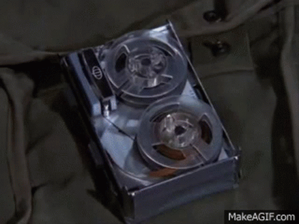

# Secure Backup Communication Network (SEBCOM)
A secure backup communication system. Doesn't rely on cellular networks. Doesn't use screens.

## What is it?
Have you ever needed to communicate in an area without a cellular network? You maybe realized that in such a situation, our high-tech phones are as useless as a rock.

This project provides a solution, and enables even the transmission of highly confidential information.

## How does it work?

You connect your keyboard to a microcontroller, type your message, and hit enter. Your message gets encrypted (AES256) and transmitted to the receiver on the 868 MHz frequency band (915 MHz in the U.S.). 

When you receive a message, it gets decrypted, and will be displayed upon a button click from your side. Once you decide to read the message, it exists nowhere but on the ePaper display: It stays -- even in the case of power loss -- on screen until you hit a reset button. 

(Yes, this resembles mission impossible)

By design, this system stores messages only temporarily and displays them only on an ePaper design. Coming back to the comparison with your phone, even with cellular network reception, a key difference to your phone is that this solution doesn't use a screen that can be monitored by third-party applications, such as Pegasus [1].

Lastly, note that this system was not created by a group of paranoid people. For some computer scientists, it is fun creating an encrypted communication system from the bottom up. Including for us.

## Technical Details

The communication relies on the LoRa modulation technique and uses free frequency bands (868 MHz in the EU and 915 MHz in the U.S.). The range is about 17 km (10 miles) in rural areas; however, the record is 832 km [2]. It has to be admitted that they used a baloon so that there were no obstacles in between.

### Recipe for one communication node
You need
- 1x microcontroller with LoRa connectivity (such as Arduino MKR 1300)
- 1x ePaper display
- 1x 74HC inverter IC
- 1x keyboard (either with a PS2 connection or a PS2 to USB adapter)
- 2x LED
- 2x 220 Ohm resistor
- 1x tactile button
  
(We will post the circuit here)

## Outlook

For efficiency and security reasons, we want to perform the encryption in hardware. We will implement this once the ATECC608B chip is available (probably somewhen in 2022).

[1] https://citizenlab.ca/2020/01/stopping-the-press-new-york-times-journalist-targeted-by-saudi-linked-pegasus-spyware-operator/

[2] https://www.thethingsnetwork.org/article/lorawan-world-record-broken-twice-in-single-experiment-1